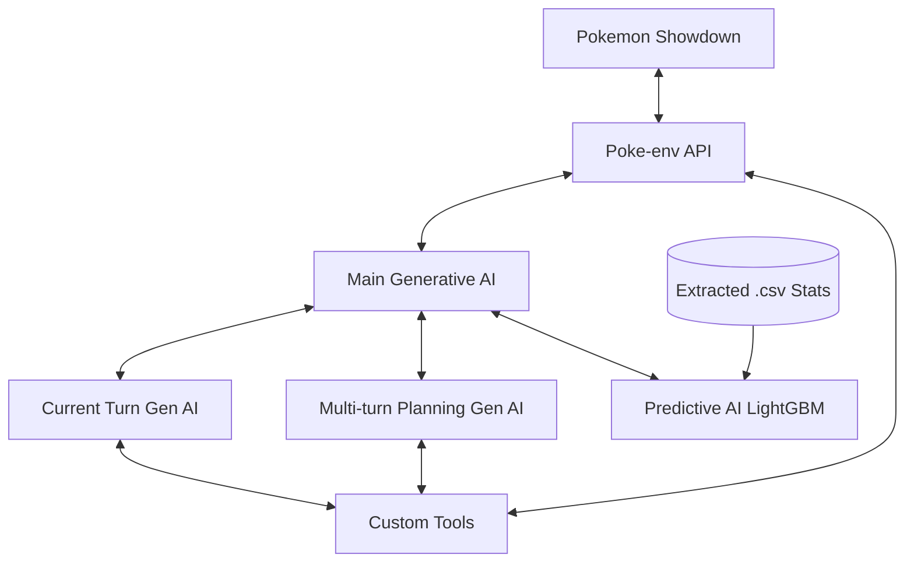

# Pokestral: AI-Driven Pokemon Battle Agent

Welcome to **Pokestral**, an advanced, multi-agent artificial intelligence project designed to play competitive Pokemon matches. This project leverages a combination of Generative AIs, predictive machine learning models, and custom tools to analyze battle states, predict opponent behavior, and execute optimal strategies against human players.

---

## 1. Introduction

### 1.1 The Basics of Pokemon
At its core, Pokemon is a turn-based tactical game where two players face off with a team of up to six creatures (Pokemons). Each Pokemon has a specific typing (e.g., Fire, Water, Grass), statistics (Health, Attack, Speed, etc.), a unique ability, and up to four moves. The objective is simple: reduce the Health Points (HP) of all six of the opponent's Pokemon to zero before they do the same to yours.

### 1.2 The Basics of Pokemon Strategy
While the rules are simple, competitive Pokemon is an incredibly complex game of incomplete information:
* **Type Matchups:** Attacks can be super effective (dealing double damage), not very effective (half damage), or completely ineffective based on the defending Pokemon's typing.
* **Prediction and Switching:** Because you can switch your active Pokemon during a turn instead of attacking, a massive part of the strategy involves predicting your opponent's actions. If you expect a Water-type attack, you might switch to a Water-resistant Pokemon. If the opponent anticipates your switch, they might use a different attack to punish your incoming Pokemon.
* **Complexity:** The decision tree in Pokemon branches exponentially. Players must consider risk management, long-term win conditions, hidden information (what moves or items the opponent has and hasn't used yet), and random variables (damage rolls, critical hits, accuracy). This immense complexity is what makes building a competent AI for Pokemon such a significant challenge.

### 1.3 How to Use the Tool
To play against our AI, we have set up two web interfaces:
1. **Pokemon Showdown Server:** Visit [showdown.anhilyx.fr](https://showdown.anhilyx.fr). Here, you will need to create an account and note down your username.
2. **Pokestral Interface:** Visit [pokestral.anhilyx.fr](https://pokestral.anhilyx.fr). **Once you are logged into Showdown**, enter your Showdown username on the Pokestral interface and send a duel request.

> After sending the request from Pokestral, you will receive a match challenge from the AI directly on Showdown.
*Note: In our current version, the AI only plays **Random Battles**. This is an official game format where both players are provided with randomly generated, competitively balanced teams, meaning neither player knows their team or the opponent's team before the match begins.*

---

## 2. Architecture

The project relies on a multi-agent system where different AIs communicate with each other and interact with the game environment through specific interfaces.

### 2.1 Pokemon Showdown
[Pokemon Showdown](https://pokemonshowdown.com/) is the premier open-source Pokemon battle simulator. Hosting it was straightforward: the developers provide a NodeJS version that can be self-hosted. We simply wrapped this environment in a Docker container for easier deployment and management on our servers.

### 2.2 Poke-env
[Poke-env](https://poke-env.readthedocs.io/) is a Python interface designed to communicate with Pokemon Showdown. It allows code to send instructions, retrieve available actions, and get almost all available information about an ongoing match. In our architecture, we built a custom API that acts as an interface between Poke-env and our agents (or an external user testing the system), handling the transmission of state data and the reception of battle commands.

### 2.3 The AI Agents
Our system delegates the decision-making process to several specialized AIs. We tested multiple Generative AI models to find the right balance of reasoning and reliability:
* **Qwen 3.5 4B:** Showed surprisingly good results for its small size, but suffered from major drawbacks: it completely lacked predictive capabilities and had a strong tendency to hallucinate game information.
* **Qwen 2.5 32B:** Offered much better reasoning than the 4B model, but still hallucinated data and struggled significantly with long-term strategic planning, while also being much slower and more expensive to run.
* **Mistral Large (127B):** This is the model used in our current provided version. It demonstrates solid reasoning and is capable of making good predictions. However, despite trying several prompting variants, it still occasionally fails to strictly adhere to the type matchup chart and sometimes requests impossible actions (it eventually self-corrects after a few retries).
* **Gemini:** During our web-based testing, Gemini yielded by far the best results. Even the "Flash" (fast) version made excellent decisions without being given the full context nor tool access. The "Pro" version made incredibly strong strategic choices, with only minor errors that would likely vanish with full context. Unfortunately, the free API limitations (10 requests/minute, 250 requests/day) made it impossible to implement for full matches, as a single battle would exhaust the daily quota and hit rate limits even before the match ended.

#### 2.3.1 Main AI
This is the orchestrator. It gathers the outputs and analyses from all the other sub-AIs, cross-references them, and makes the final decision for the turn. We provide it with the initial responses of the sub-AIs so it rarely needs to query them again, but it has the option to re-prompt them with specific constraints or questions if necessary.

#### 2.3.2 Predictive AI
This is a machine learning model based on **LightGBM**. Its sole purpose is to predict the binary choice: *should we switch our Pokemon, or should we attack?* Generative AIs often struggle immensely with this specific decision (frequently getting "stuck" favoring one over the other). This predictive AI serves as a hard anchor to resolve that flaw. We originally planned to predict other variables (like the opponent's exact move), but the sheer complexity and parameter count of the switch/attack choice consumed our available development time.

#### 2.3.3 Current Turn Generative AI
This agent focuses purely on executing the optimal action for the current turn. It has access to our suite of tools to decide whether to attack (and which move to use), switch (and to which Pokemon), and trigger mechanics like Mega-Evolution. By default, it receives a context equivalent to what a human player sees at a glance, plus essential strategic data (type charts, available valid actions, and strategic tips). The Main AI can also feed it additional constraints to guide its output.

#### 2.3.4 Multi-Turn Planning Generative AI
Operating similarly to the Current Turn AI, this agent looks ahead. Its prompt is heavily tailored towards long-term prediction and planning. To keep it focused on the future rather than the present, it is intentionally *not* given explicit access to the immediately available action list, forcing it to analyze the broader trajectory of the match.

### 2.4 Custom Tools
To assist the Generative AIs, we developed several highly specific tools. By combining and optimizing tool calls, we drastically reduced the overhead and latency of the AI's thought process over the iterations:
* **Environment Tools:** Retrieve current match data via Poke-env.
* **Pokedex/Database Tool:** Provides **detailed** descriptions of moves, items, and abilities, accounting for rare edge-cases that, when summed up, occur somewhat frequently in actual gameplay.
* **Damage Calculator:** Calculates the damage ranges a specific move will do in a given scenario, allowing the AI to know if an attack will result in a guaranteed knockout, and in which situations.
* **Type Chart Tool:** A critical tool that returns type effectiveness. We built it to handle both generic types and specific Pokemon (handling dual-typings was a major stumbling block for the LLMs, making this tool an absolute necessity. Additionnaly, the Damage Calculator tool was often ignored when the AI thought of a wrong type-interaction that contradicted it.).

### 2.5 CSV Data & Analytics
We extracted massive amounts of battle data from Pokemon Showdown's official repository. We parsed JSON files into normalized CSVs and converted raw text battle logs into structured datasets. Currently, this data trains our Predictive AI (LightGBM).

> *Note: We ideally wanted to feed this data to the Generative AIs to help them deduce standard opponent sets (e.g., "What are the 4 most common moves for this specific enemy?"). Due to time constraints, this link between the generative agents and the historical CSV data was not implemented.*

---

## 3. Future Improvements

While Pokestral is fully functional, there are several avenues that should be explored to improve the agent's strength and fluidity:

### 3.1 Testing with the Gemini API
Testing other LLMs via their APIs is our primary target. Given how incredibly well Gemini performed in web tests, integrating it fully with tool access and complete context would likely result in a massive leap in the AI's playing strength. This would also require adjusting our prompts and tool definitions to fit the new model's logic.

### 3.2 Expanded Predictive Models
We plan to expand the LightGBM models (or introduce new ML architectures) to predict more granular events, such as anticipating the exact move the opponent will use next, or predicting the opponent's optimal switch.

### 3.3 Reinforcement Learning (RL)
We strongly considered implementing a **Reinforcement Learning** agent — an AI that learns strictly through trial and error by playing its matches and optimizing a reward function. We did not start this due to time limitations and extreme complexity, but adding an RL layer could fix inherent biases that our current prompt-based Generative AIs will retain regardless of how many times they run, even if it probably wouldn't have been enough on its own to reach a competitive layer, due to the complexity of predicting multiple turns ahead.

### 3.4 Speed and Fluidity Optimization
Currently, the AI takes several tens of seconds to deliberate on a turn. While completely playable, it is not a fluid experience. Furthermore, the AI currently wastes time "thinking" even when there is only one valid legal move (e.g., if a Pokemon is trapped and locked into a move). Implementing heuristic fast-paths to skip AI deliberation when choices are forced would drastically improve user experience, and optimizing the overall reasoning process (potentially by reducing the number of tool calls even more or streamlining prompts) would further reduce latency.

### 3.5 Autonomous Team Building
Right now, the AI is restricted to Random Battles (or hardcoding a specific team into the backend). A highly fascinating evolution of this project would be giving the AI the ability to draft its own competitive team from scratch. This would require new specific Generative AI roles and heavy support from the predictive data models to analyze the current meta-game.

### 3.6 Automated Testing & Quality Benchmarking
A critical final step would be the implementation of a comprehensive testing suite. 
* **Edge-Case Validation:** During manual testing, we discovered several rare Pokémon interactions (abilities, niche move effects) that confused the AI. Automated unit tests for these specific scenarios would ensure the tools and prompts handle them correctly. 
* **Quantifiable Performance Metrics:** We need to move beyond "feeling" that the AI is better. An idea would be to use the built-in Showdown laddering system to have the AI tested against a large sample of real human players, tracking its win rate, average opponent rank. But, aside from the long thinking time, it presented two issues : the rules of Showdown that doesn't allow to use bots on their real server (the one with enough players to ladder against), and the fact that this method would only account for the winrate, and not on more specific details. So this last point would still need more thoughts to be properly implementable.